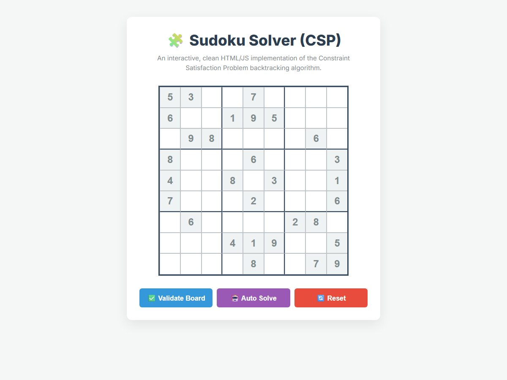
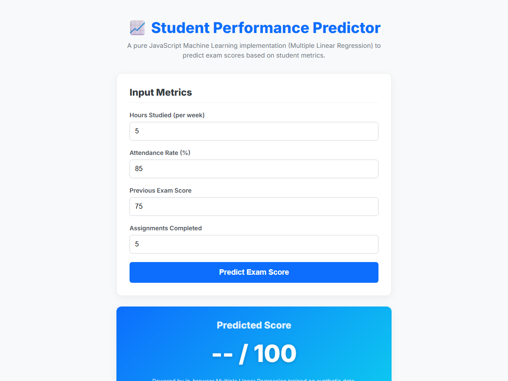

# 🤖 AI Problem Solving Assignment

**Registration Number:** `RA2410026050027`

This repository contains two **completely independent** web applications built from scratch using pure HTML, CSS, and Vanilla JavaScript. There is absolutely no backend or connection between them.

---

## 🧩 Problem 6: Sudoku Solver (Constraint Satisfaction Problem)

### Overview
A completely self-contained web app that uses the **Constraint Satisfaction Problem (CSP)** backtracking algorithm written in JavaScript to instantly solve a 9x9 Sudoku puzzle directly in your browser.

### 📸 Screenshot

### How to Run
1. Navigate to the `Sudoku_Solver` folder.
2. Double-click `index.html` to open it in your browser. No server required!

---

## 📈 Problem 18: Student Performance Predictor (Machine Learning)

### Overview
A purely client-side Machine Learning dashboard. Upon loading the page, it uses JavaScript to generate 200 synthetic data samples and runs a **Multiple Linear Regression (Gradient Descent)** training loop in the browser. It then accepts user inputs to predict final exam scores.

### 📸 Screenshot

### How to Run
1. Navigate to the `Student_Predictor` folder.
2. Double-click `index.html` to open it in your browser. No server required!
